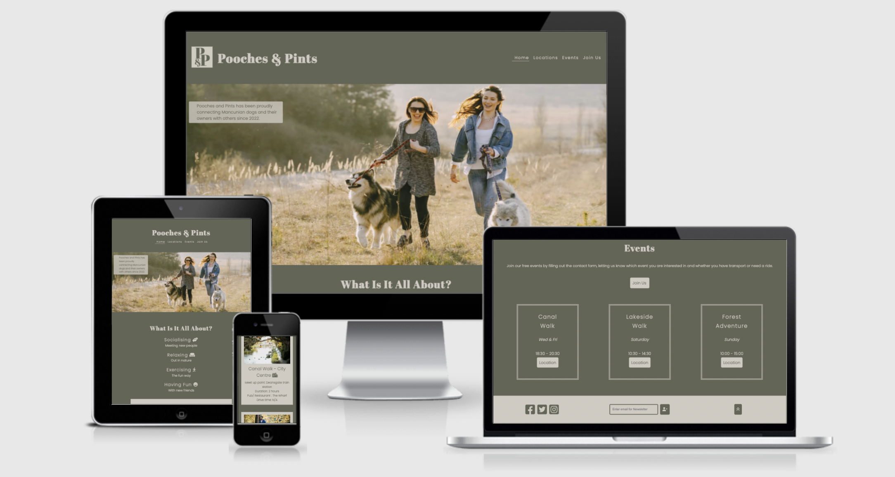
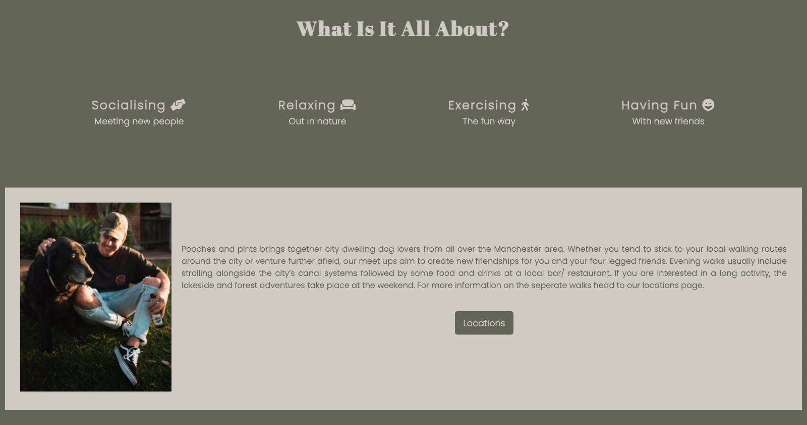
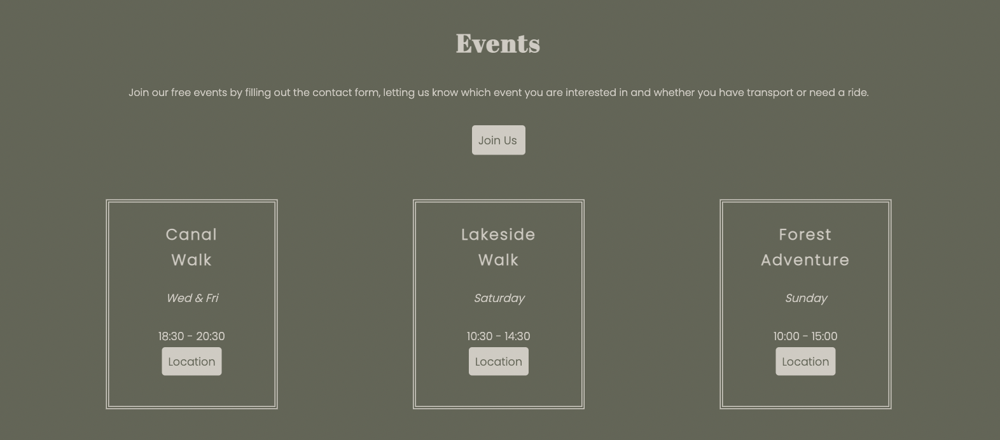
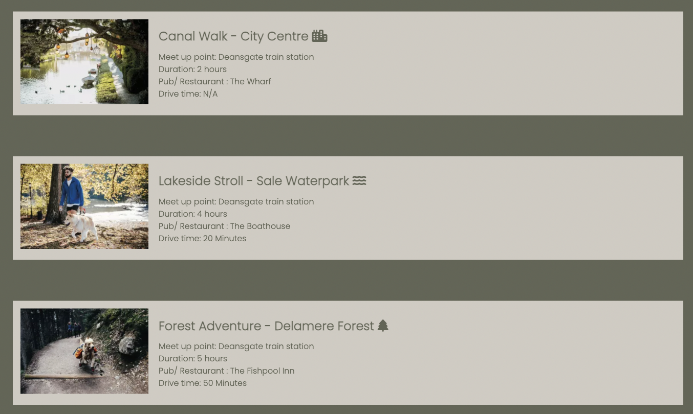
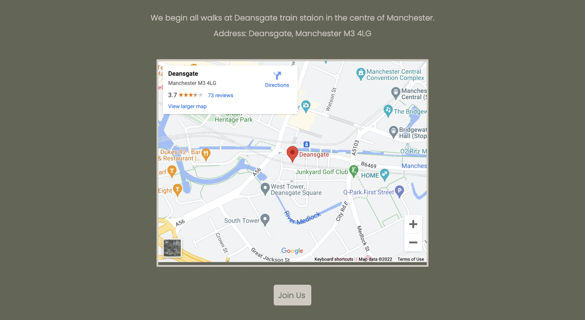
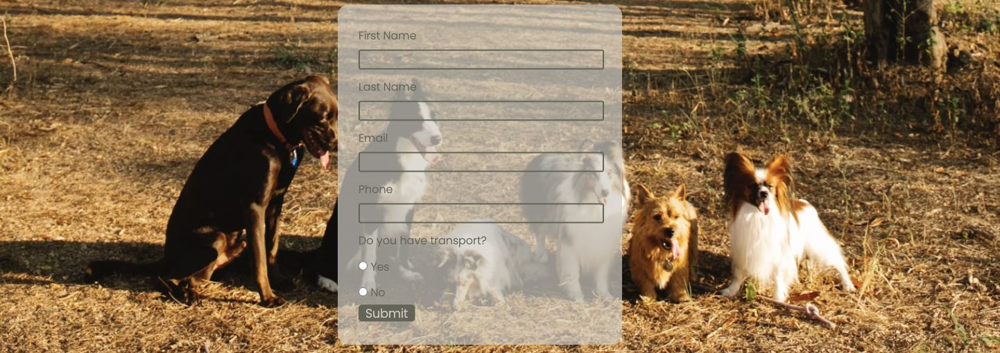
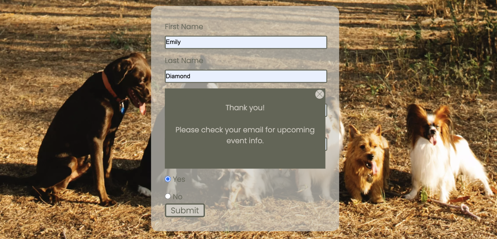
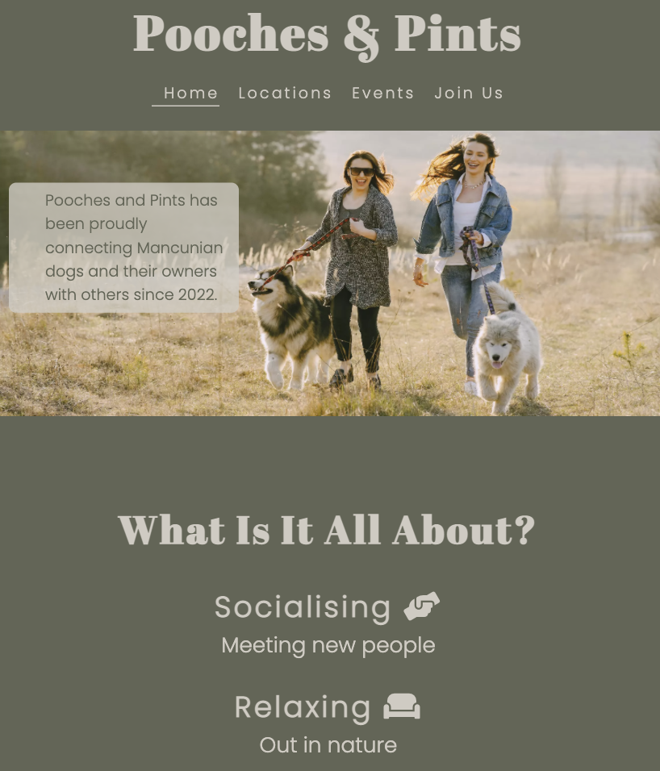

# Pooches & Pints

Pooches and Pints is a site bringing together people and their pets across the Manchester area. Pet owners looking to meet and socialise with other people will come to the site to join others at organsied times and locations. People without transport who are normally confined to the city will be able to get out and explore with the help of fellow dog walkers, and those who normally walk alone will find friends in the community and enjoy their pets together.

[View the live project here](https://ejdiamond.github.io/pooches_and_pints/index.html)

# User Experience (UX)

### User stories

#### First Time Visitor Goals

- a) As a First Time Visitor, I want to easily understand the main purpose of the site.
- b) As a First Time Visitor, I want to be able to easily navigate throughout the site to find content.
- c) As a First Time Visitor, I want to locate their social media links to see their followings and connect with local people.

#### Returning Visitor Goals

- a) As a Returning Visitor, I want to find information about weekly meet ups.
- b) As a Returning Visitor, I want to find the best way to get in contact and sign up for weekly events.

#### Frequent User Goals

- a) As a Frequent User, I want to check to see if the existing weekly events have had any changes made.
- b) As a Frequent User, I want to sign up to the Newsletter so that I am emailed with any newly scheduled events.

### Design

#### Colour Scheme

- The two main colours used are green (#d0cbc2) and cream (#626556de).
- These colours where selected as they compliment eachother and are colourful without being too loud makimng for an enjoyable user experience.

#### Typography

- The Abril Fatface font is used for the headings, whilst the main body font used is Poppins light, both being used throughout the whole website with Sans Serif as the fallback font in case for any reason the font isn't being imported into the site correctly. The fonts pair well together and are clean and easy to read making them both attractive and appropriate.

#### Imagery

- The hero image placed, represents simply what the website is for, meeting up and socialising with other dog owners as well as being eyecatching and drawing the user in.

### Wireframes

* [Desktop Wireframe](https://github.com/EJDiamond/pooches_and_pints/blob/7581d7f0314c6c91dac27100fd452bc112551f69/assets/images/wireframe.png)

* [Initial Mobile Wireframe](https://github.com/EJDiamond/pooches_and_pints/blob/main/assets/images/initial_mobile_wireframe.png)

* [Revised Mobile Wireframe](https://github.com/EJDiamond/pooches_and_pints/blob/main/assets/images/revised_mobile_wireframe.png)

# Features

### Existing Features

- __Navigation Bar__

   - The fully responsive navigation bar will consist of a logo, including logo image and title, as well as 4 navigation links, preventing the user from having to press back once they reach another page of the site.
   - It will be the same across the three pages for continuinty, making it easier for the user to learn and use quickly.
   - The logo image which also acts as a return to homepage link, is removed on smaller devices to make for a less cluttered header the user can navigate through.

- __Landing Image__

   - The hero image is eye catching and draws the user in, introducing them to Pooches and Pints.
   - The text overlay effectively explains what the site is about, the user being targeted and the area the meetups are located.
   - The image and text overlay are responsive meaning they are not comprimised when viewed on different screen sizes.

- __All About Section__

   - The all about section outlines what the user will experience and benefit from if they join the Pooch and Pints meet ups, drawing them in and encouraging them to join.
   - The four main points have familiar icons the user will recognise making the section more relatable, whilst being responsive and easy to read on all screen types.
   - The description section including the image and content and contained in a box creating an opposite color scheme from the rest of the page, this makes breaks the page up and makes it more interesting to the user.
   - The image of the man and dog a beer garden, leaves the user desiring them and their pet in a similar scenario.
   - The paragraph description looks deeper into what Pooches and Pints is all about, the different types of walks and explains how the user can benefit.
   - The location button links to the location page, where the user can browse the various walks and find out if there is one they are interested in, again encouraging them to join. The button makes for a quick user expereince for people who are perhaps wanting quickly look over all that is available to them. 

- __Events Section__

   - This section has a short paragraph explaining that the user can use the button below it, to navigate to the join up page, as opposed to scrolling back up to the navigation bar in the footer.
   - The three boxes outline clearly the seperate events, the style, duration and location of each walk.
   - The location button inside each box corresponds to the relevant walk on the location page for a quick link to the walk the user is interested in, for a more efficient navigation to what they are interested in.
   - The three box are repsonsive and therefore when viewed on a smaller screen will present in a column for an easy scrolling experience.

- __Footer__
   
   - The footer which is replicated on each page, has the opposite colour scheme to the rest of the pages making it stand out to the user and show clearly the elements it contains.
   - The social links, newsletter form with button and "to the top" button are all of a consistent size, making them more streamline and aesthetically pleasing to the user.
   - The social links use clear recognisable icons of uniform shape for easy recognisition by the user.
   - The sign up for newsletter form has the same green coloured background again making it more pleasing on the eye. The icon used for the sign up button is a widely recognised add user button making it clear what the form is for.
   - The "to the top" button is also a widely use icon, the user will know that the button will take them to the top of the page they are currently on meaning less scrolling and a more efficient and enjoyable experience.

- __Locations Section__

   - The location section is broken up into the three corresponding events on the homepage, each has a clear image of the walk location and the walk information clearly next to it.
   - Showing images of the locations lets the user know what they can expect from each and in turn will help them to decide which walk is for them.
   - The decriptions for each are laid out in the same way for continuity, making it easy to skim read if needed and find the details the user is looking for.
   - The icons used for each walk represent the style of the walk, meaning if future walks are added users will have an idea of what to expect.
   - The three boxes are responsive, viewed on a smaller screen the user can smoothly scroll down to find wha they are looking for.

- __Meet Up Location Map__
   
   - Above the map is a short description and address outlining the meet up location of all the walks.
   - The map is centered and clear in a small border, linked to a google map.
   - Including the map on the site means the user doesn't need to leave to a new site to find out if the location suits them, making it more convinient and meaning they are more likely to join as opposed to leaving the site to view a map and not returning.
   - An additional join up button is used below the map, linking to the join up page so the user needs not scroll back up to the header to find the navigation to the relevant page.

- __Sign Up Page__

   - This page allows the user to sign up for Pooches and Pints by entering their full name, email and phone number as well as selecting whether or not they have their own transport.

- __Thank You Pop Up__

   - Once the user has entered their information into the form and pressed submit, the thank you modal will pop up.

- __404 Error Page__

   - The 404 error page contains a relevant image and an text layover explaining to the user they have reached a page that doesn't exist, with a link back to the Pooches and Pints homepage.

# Frameworks, Libraries and Programmes Used

- [Google Fonts](https://fonts.google.com/)
   - Used to import Abril Fatface and Poppins fonts into the css style sheet and used throughout the site.

- [Font Awesome](https://fontawesome.com/)
   - Used to import icons used in:
         - the footer of the page for social icons, sign up and to top button.
         - the locations section for marking different types of walks.

- [Github](https://github.com/)
   - Used to save project code from Git.

- [Adobe Illustrator](https://www.adobe.com/)
   - Used to create 
      - logo used in the header image.
      - wireframes

# Testing

## Navigation Bar and Footer

   - The navigation bar and footer contain effective links which move aorund the sight successfully.
   - The newsletter in footer only ssubmit when filled in with an email and when submited the code institute form dump page opens.

## Buttons

   - All anchors across the site link to the relevant sections they were intended to navigate to.

## Responsiveness

   - When the user is viewing on different size screens the content changes dependent on the screen.
   - Below screen width 780px elements of the design including the header, footer and other body content, take the direction of column using a flex both, meaning when the screen size is reduced to this size the user simply has to scroll down.
   - The background hero image is changed from a cover to contain background so as the user can still experience the full image on smaller screens.

   

## Validator Testing

- HTML
   - No errors were shown when passed through the HTML [W3C Validator](https://validator.w3.org/nu/?doc=https%3A%2F%2Fejdiamond.github.io%2Fpooches_and_pints%2F)

- CSS
   - No errors were shown when passed through the [CSS Validator](https://jigsaw.w3.org/css-validator/validator?uri=https%3A%2F%2Fejdiamond.github.io%2Fpooches_and_pints%2F&profile=css3svg&usermedium=all&warning=1&vextwarning=&lang=en)

## Unfixed Bugs

- On some mobile devices the hero outer section pushes down the all about section leaving space between the two.

## Testing User Stories From User Experience Section

- __First Time Visitor Goals__

   - a) As a First Time Visitor, I want to easily understand the main purpose of the site.
      - The logo and hero image/text are eyecatching andeffective in displaying what the site is for.
      - The user has the option to scroll down or navigate to other pages.

   - b) As a First Time Visitor, I want to be able to easily navigate throughout the site to find content.
      - The navigation bar in the header is clear and uses :hover to show the user which page they are currently on.
      - The three pages are kept consistent by using the same nav links and layout for them.

   - c) As a First Time Visitor, I want to locate their social media links to see their followings and connect with local people.
      - The social media links are displayed clearly in the footer with easily recognised icons.
      - The social links open blank pages so as not to direct the user away from the site.

- __Returning Visitor Goals__

   - a) As a Returning Visitor, I want to find information about weekly meet ups.
      - Information on weekly meet ups is displayed clearly on the sites home page, the user simply scrolls down from the heading.
      - Alternatively, the user can use the events link in the navigation bar to save time scrolling.

   - b) As a Returning Visitor, I want to find the best way to get in contact and sign up for weekly events.
      - Sign up for newsletter forms are located in the footer on each page with icon buttons clearly showing what is achived by filling it in.
      - The sign up page is clear and concise with inputs for first and last name as well as email and phone number. 

- __Frequent User Goals__

   - a) As a Frequent User, I want to check to see if the existing weekly events have had any changes made.
      -  The events section is clearly laid out with all the main information including locations, times and dates.
      - The location page gives more detailed information on all events.

   - b) As a Frequent User, I want to sign up to the Newsletter so that I am emailed with any newly scheduled events.
      - Sign up for newsletter forms are located in the footer on each page with icon buttons clearly showing what is achived by filling it in.

# Deployment

The site was deployed through Github pages using the following steps:
   - Open the Github repository
   - Click the settings button
   - Scroll down and hit the git hub page setting button
   - From the source dropdown, select main branch
   - The site delpoys automatically and can be found via the following link:
      - [Pooches and Pints](https://ejdiamond.github.io/pooches_and_pints/)

# Credits

## Content

- Instructions for how to use flex boxes were used from a [YouTube Tutorial](https://www.youtube.com/watch?v=e2RQM4pE8uI)
- Instructions for how to create a pure CSS modal pop up were used from a [YouTube Tutorial](https://www.youtube.com/watch?v=QButPwQ51wQ&list=PL_pBKMVHaanEK6aQOJkn2qWoOS9d_p2iy&index=1)
- Instructions for how to create a 404 error page were taken from a [Github tutorial](https://docs.github.com/en/pages/getting-started-with-github-pages/creating-a-custom-404-page-for-your-github-pages-site)

## Media

- Images used across the site were taken from [Pexels](https://www.pexels.com/)

